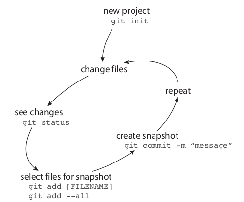
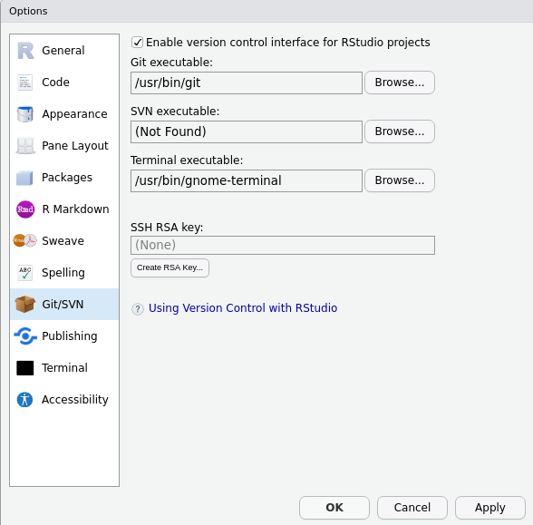
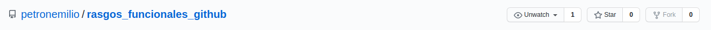
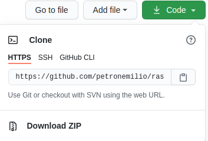
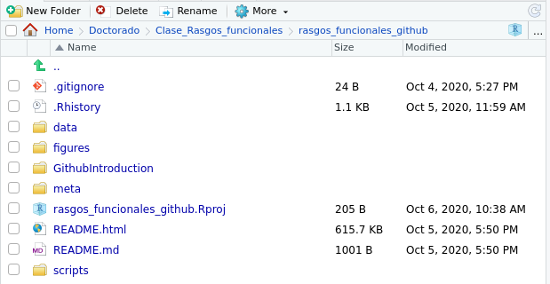
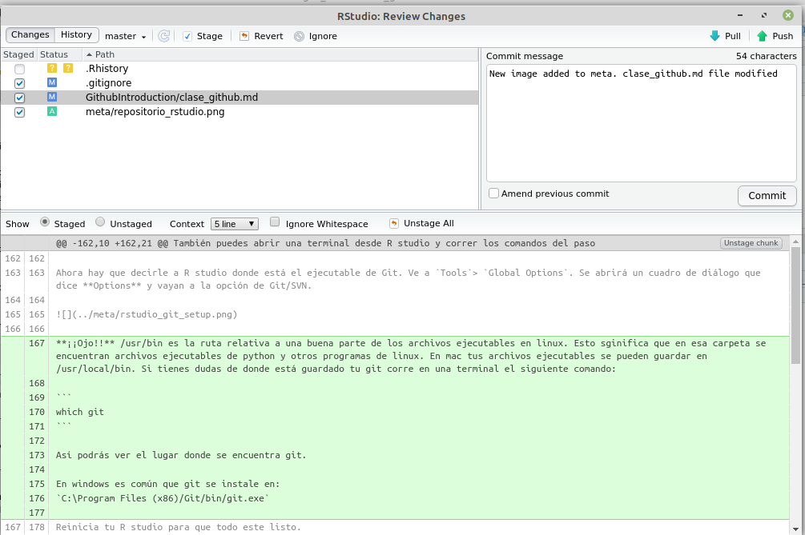
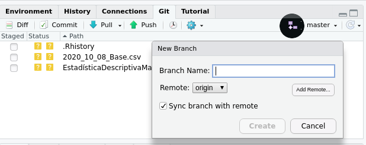

## Introducción a Git y GitHub

#### Requerimientos:

Para poder llevar a cabo esta clase necesitas tener instalado:

- [R](https://cran.r-project.org/)
- [R studio](https://rstudio.com/)
- [git](https://git-scm.com/downloads)

Además necesitas tener una cuenta de [github](https://github.com/). 

#### ¿Qué vamos a ver durante la clase? 

1.  Breve introducción a los sistemas de control de versiones (VCS, por sus siglas en inglés). 

2.  VCS locales: Git.
    * Repositorios y su organización.
    * Comandos básicos y flujo de trabajo. 
    * `Branch` y `merge`: conceptos útiles para entender cómo funciona el programa.

3.  VCS remotos : Github
    * ¿Qué es github y cómo uso una cuenta?
    * Un par de comandos más en github. 
    * Hacer introducción con hello world!
  
4.  Ventajas de usar Git y Github: reproducibilidad, organziación.

5. Usando Github desde R studio.
    * Configura tu cuenta de git en la computadora desde R studio.
    * Clonar un repositorio desde R studio.


### Sistemas de control de versiones

Los **VCS** son una herramienta para registrar y organizar cambios en una serie de archivos y directorios. Los VCS hacen una base de datos del historial de versiones de un proyecto. Git y Github son ejemplos de VCS pero no son los únicos programas que permiten hacer un control de versiones (por ejemplo, [mercurial](https://www.mercurial-scm.org/about) o [Subversion](http://subversion.apache.org/)). 

### VCS locales: Git

[Git](https://gitforwindows.org/) es un VCS local con distribución en windows, mac y linux. Fue diseñado por Linus Trovalds para la creación de Linux y es de código abierto. ¡Sí! Los VCS permiten crear cosas increíbles, como Linux.


Los archivos y directorios que están sujetos a un historial de versiones en git se guardan de forma **local**. En otras palabras, solo existen en tú computadora. Pero, ¿cómo funciona git?

#### Repositorios y su organización.

Lo primero que hay que hacer en git es definir el directorio que estará sujeto a un historial de versiones, es decir un **repositorio** (¡¡¡Ding, ding ding!!! Concepto importante). Para que quede claro repitamos que es un repositorio: un directorio sujeto a control de versiones.  
¿Cuál es la forma más común de organizar un repositorio?
Aunque no hay un concenso es común encontrar repositorios que constan de cuatro directorios: 

- **data**
- **scripts/bin**
- **figures**
- **meta**

Además de esas carpetas los repositorios **siempre** tienen un archivo llamado **README**. El **README** file puede estar en formato [markdown](https://www.markdownguide.org/getting-started/) o en otros formatos pero siempre contiene la misma información. ¿Cuál es esa información? 

Algunos ejemplos de como se organizan los repositorios:

- [Phytools](https://github.com/liamrevell/phytools/)
- [detectionfilter](https://github.com/TobiasRoth/detectionfilter)
- [taxize](https://github.com/ropensci/taxize)

Como podrás ver, el README contiene una descripción del repositorio así como de la organización del mismo. En el se explica de forma breve y clara lo que vas a encontrar en las diferentes carpetas y que hacen los scripts.

#### Comandos básicos y flujo de trabajo. 

Para que git sepa cuál es el repositorio que queremos tener bajo control de versiones se corre el comando `init`. Después se sigue un flujo de comandos que permite tener un buen historial de las versiones que irá cambiando con el tiempo. A continuación se presenta dicho flujo de trabajo:

1. **init:** `$ git init` 
     `Initilized empty Git repository in /rasgos_funcionales_github/.git` 
2. Realizar cambios en el repositorio: crear archivos nuevos, cambiar o editar archivos.
3. `$ git status`: Nos dice si hay nuevos archivos, si se han eliminado archivos o si se han modificado archivos que ya son seguidos por git.
4. **add:**`$ git add [FILENAME]`: Agrega los archivos que quieres que git les siga la pista. Después de modificar un archivo debes de volver a correr `git add`.
5. **commit:**`$ git commit -m "mensaje sobre los cambios"`: Después de modificar un archivo hay que dejar un mensaje claro y preciso de las modificaciones realizadas en en tus archivos.
6. Repetir a partir del punto 2.



#### `Branch` y `merge`: conceptos útiles para entender cómo funciona el programa.

Otro par de comandos (también pueden ser vistos como conceptos) centrales en git son `branch` y `merge`. `branch` crea una copia del repositorio principal (**master** branch) para realizar cambios que no comprometen al repositorio principal o la **master** branch. Cuando creamos ramas estamos buscando solucionar un problema en específico de nuestro código o archivo. Imagina que una rama creada a partir de tu repo original te permitirá experimentar y probar muchas nuevas soluciones en tú código sin temor a que tu código "*ya no corra*".

Al crear una rama es importante elegir un nombre que refleje los objetivos que se planean mejorar de la **master** branch. Se realizan cambios en la `branch secundaria` con sus respectivos `commit` de la misma forma que se realizarían en la `master` branch. Una vez que logramos el objetivo por el cuál se creo la rama secundaria, se hace un `merge` de la `branch scundaria` con la **master** branch.

Un esquema del proceso de hacer branches se ilustra en el siguiente esquema:

](../meta/branches.png)

Git es un buen programa para detectar los cambios en las diferentes `branches` y dejar una versión final al hacer un `merge` de las diferentes versiones del repositorio. ¿Qué pasaría si haces un branch y haces el mismo cambio en la misma línea de la `master` branch y de una `secundaria`? 


Si haces una `branch` y haces la misma modificación en ella y en la `master` branch git detectará conflictos y no podrá realizar el merge. Por eso es importante considerar bien los objetivos iniciales al crear una `branch`.

Los branches permiten la colaboración de mucha gente en un proyecto de tal forma que múltiples personas pueden modificar código sin comprometer el código principal. Los `branches` son muy importantes en el mantra de git y se refleja en el logotipo del programa. 


Con esta breve introducción de Git estamos listos para brincar a Github, que al igual que Git siguen la misma filosofía.

### VCS remotos: Github

#### ¿Qué es github y como uso una cuenta?
Es un sitio web para trabajar y colaborar en proyectos que están sujetos a control de versiones basado en **git** y que guarda los repositorios en la red. En otras palabras guarda los repositorios de forma remota. También es una especie de red social de código. La gente puede ver tu perfil y tus repositorios y tú puedes ver el perfil de otros usuarios. 

El flujo de trabajo de git y github es muy parecido. Para usar github hay que agregar unos conceptos/comandos extras que permiten tener una comunicación entre repos locales y remotos:

1. **fork**: cuando creas una copia de un repositorio en tu cuenta de Github a partir de otra cuenta de github. Más documentación del `fork` en [github](https://docs.github.com/en/enterprise-server@2.20/github/getting-started-with-github/fork-a-repo#fork-an-example-repository) y [aquí](https://github.com/octocat/Spoon-Knife) un repo para practicar el fork  
2. **clone**: baja el repositorio remoto a tu cuenta local (a tu computadora).
3. **pull**: baja la última versión de un repositorio remoto y se incorporan los cambios con tu repositorio local. 
4. **push**: envias los cambios y commits del repositorio local al repositorio remoto u _online_. Esto solo enviara los cambios a tu repositorio forkeado. Si quieres que los cambios lleguen como sugerencia a el dueño del repositorio deberas hacer un `pull request`.
5. **pull request**: si tu no eres propietario de un repositorio remoto debes de subir tus cambios como sugerencia de cambio. Tu no haces el `push`, sino que sugieres al autor que haga un `pull` de tus cambios (por eso el `pull request`). Una vez que el propietario del repositorio ha revisado tus cambios, este decide si acepta los cambios. Es recomendable hacer cambios a partir de una branch, de tal forma que el dueño del repo fusiona las ramas con un `merge` en caso de que acepte las sugerencias de cambio.

#### Hacer introducción con hello world!

Ahora que ya sabemos un poco sobre git y github hagamos nuestra primer actividad. Ve a la [intro: hello-world](https://guides.github.com/activities/hello-world/) de github. Leela con cuidado, haz los pasos del ejercicio y nos vemos en 10 minutos.

El proceso de hacer ramas se puede poner muy complicado. Aquí dejo un link para que vean un modelo exitoso de [branches](https://nvie.com/posts/a-successful-git-branching-model/)!

El proceso general de trabajar en repositorios remotos personales:

**Pull** > **Hacer cambios** > **Add** > **Commit** > **Push** > **Repeat**
                                           
¿Cómo sería el proceso de cambiar un repositorio __forkeado__ para que el dueño realice los cambios?          
Otras guías que te pueden ayudar a entender como funciona github las encuentras en las siguientes ligas:

- Buena guía del [workflow](https://guides.github.com/introduction/flow/)
- Juego de [branches](https://learngitbranching.js.org/?locale=es_AR). 


### Ventajas de usar Git y Github

Aprender y ejecutar los comandos y repetirlo podría quitar mucho tiempo. Manejar muchas `branches` no parece ser algo muy práctico. Entonces, ¿cuáles serían las ventajas de utilizar git y github?

- Permite organizar mejor tus proyectos.


- Puedes recuperar versiones de repositorios completos pasados.

- Te fuerza a compartir tu código y eso al final hace que la ciencia sea más abierta y reproducible.

- Manejar mejor la solución de problemas en un código al trabajar de forma colaborativa.

- Tener experiencia en github es un muy buen elemento curricular.


### Usando Github desde R studio.

#### Preparación inicial

Ahora trataremos de hacer un repositorio usando R studio. Antes de clonar el repositorio es importante configurar git en tu computadora. Esto se puede hacer de varias formas:

1. Si tienes familiaridad con la terminal (Mac, Linux) abrela y escribe:
``` bash
git config --global user.name "petronemilio"
git config --global user.email "emilio.petrone@st.ib.unam.mx"
```
También puedes abrir una terminal desde R studio y correr los comandos del paso 1.

2. Otra opción es correr en el prompt de R o en un script de r los siguientes comandos:
``` R
    ## install if needed (do this exactly once) 
    install.packages("usethis")
    library(usethis)
    use_git_config(user.name = "petronemilio", user.email = "emilio.petrone@st.ib.unam.mx")
```  
Al definir el `user.name` git y github sabrán como comunicarse entre sí, facilitando copiar repositorios locales y remotos. El `user.name` de tu computadora debe de ser igual al de tu cuenta de github. El correo (`user.email`) también debe ser igual en tu computadora y en tu correo.  

Ahora hay que decirle a R studio donde está el ejecutable de Git. Ve a `Tools`> `Global Options`. Se abrirá un cuadro de diálogo que dice **Options**. Vayan a la opción de Git/SVN. 



**¡¡Ojo!!** /usr/bin es la ruta relativa a una buena parte de los archivos ejecutables en linux. Esto sginifica que en esa carpeta se encuentran archivos ejecutables de, por ejemplo, python y otros programas de linux. En mac y a veces en linux tus archivos ejecutables se pueden guardar en /usr/local/bin. Si tienes dudas de donde está guardado tu git, corre en una terminal el siguiente comando:

```
which git
```

Así podrás ver el lugar donde se encuentra git. 

En windows es común que git se instale en:
`C:\Program Files (x86)/Git/bin/git.exe`

Si así fuera el caso, agrega esa ruta en la pestaña `git executable` de tú configuración global en R studio. 
Reinicia R studio para que todo este listo.

### Clonación de un repositorio desde R studio

Después de esto vamos a intentar clonar el repositorio que contiene a este archivo. Antes de clonarlo hay que hacer un `fork`. 

1. Ve a la base del repositorio y busca la pestaña que dice `Fork`:



2. Después de tener una copia del repositorio en tú cuenta ahora hay que hacer una copia local utilizando R studio. Busca el botón verde que dice `Code` en Github. Copia el url del repositorio y ve a R studio.



3. En R studio ve a File y selecciona New Project. 


4. Selecciona la opción de Version control.


5. Slecciona la opción Git.

6. Agrega el url que copiamos de la página de Git. Además selecciona el directorio donde quieres que viva el repositorio local en tu computadora. 


Si los pasos previos salieron bien estás listo para hacer una contribución a un repositorio forkeado. 

#### ¿Cómo mantener al día un repo forkeado?
Si forkeaste un repo y luego lo clonaste en R studio es importante que cada que lo vayas a modificar y utilizar realices un pull. De esa forma tendrás la última versión del repositorio remoto de tú cuenta. ¡Ojo! Al hacer ese pull la actualización solo será con respecto a tÚ repositorio forkeado. Es decir no tendrás la versión del dueño del repositorio. A continuación se muestra un diagrama de lo que ocurre al forkear y clonar el repo:

                                               
     owner/RepoDeInteres  --- fork ----> cloner/RepoDeInteres
                                               |  
                                               |
                                               |
                                             clone
                                               |  
                                        cloner/RepoDeInteres

Al clonar el repo en Rstudio solo se establece comunicación entre el repositorio local y remoto `cloner/RepoDeInteres` pero no con el `owner/RepoDeInteres`. Sería todo más fácil si la comunicación con el `owner/RepoDeInteres` fuera directa. Sin embargo, esto no se puede y hay que decirle a git cuál es el repositorio original (se le suele llamar el repo **upstream**). Para hacer eso hay dos opciones. La primer es desde la interfaz gráfica de Rstudio. Ve al ícono de branches en git. Verás un botón que dice Add Remote. Dale a esa opción y agrega en el nombre del remoto `remote` y debajo agrega el URL del `owner/repo`.
Más detalles sobre forkear y clonar los puedes encontrar [aquí](https://happygitwithr.com/fork-and-clone.html).

Ahora que tienes comunicación entre el repo originial podemos `pullear` los cambios que se realicen en el `owner/repo`. Para ello hay correr el siguiente comando en la terminal:

``` bash
git pull upstream master --ff-only
``` 
Como puedes ver, pull jalara los cambios a tu repo local desde el upstream repo.
La opción `-ff-only` solo funcionará si tu no has realizado modificaciones en el repo local. Por ello es importante que antes de empezar a trabajar en la modificación de un código te asegures de tener la versión más actualizada del repo original. Si realizas modificaciones **siempre** es recomendable hacerlo desde una branch. Eso te ahorrara muchos problemas al momento de `pullear` y `pushear`. Detalles de porque no es recomendable hacer modificaciones a la `master` branch los puedes encontrar [aquí](https://happygitwithr.com/upstream-changes.html#touched-master) 


### Primera exploración de la base.

En la siguiente sección el objetivo es entender las opciones que R studio y git nos ofrecen para modificar y ver nuestros repositorios.
Si abres un repositorio desde R studio podemos ver las carpetas que componen al repositorio.



También podemos abrir los archivos y modificarlos. Si modifico uno de los archivos del repositorio, ¿veríamos los cambios en el repositorio en github? **No**. Los cambios solo quedarían en el repositorio local. Para subir los cambios github primero debemos hacer un `commit` de nuestros archivos modificados. (recuerda hacer commits con descripciónes claras).

Busca la opción commit. Puedes picar el botón de la pestaña de git que se encuentra en la parte superior de r studio. Podrás observar los archivos que han sido modificados desde el último `commit`. Agrega los archivos que quieres que se registren el el historial de cambios y que reflejan tu mensaje en el `commit`. 



Como puedes ver, la pestaña también muestra los cambios realizados al archivo. Después de hacer el commit podemos hacer el push al repositorio remoto.

Para concluir la clase, abre el script `exploration_script.R` que se encuentra dentro de la carpeta scripts.

Verás que hay un par de cosas por resolver. Encuentra las soluciones con el código de R apropiado y haz un `pull request` para que se modifique el script que se encuentra en github. Para hacer el `pull request` crea una nueva rama. El nombre de la rama debe de reflejar la solución que estás buscando (por ejemplo: exploration_script_solved). Luego haz la modificación del script en esa rama, agrega un commit y realiza un push para que el cambio llegue a tu repositorio remoto.
En la siguiente figura se muestra el ícono que permite crear nuevas ramas.



El último paso consiste en ir a tu cuenta de github y hacer un `pull request` para que el dueño del repositorio logre ver tus cambios y decida si hace los cambios que tu estás solicitando.


Si quieres ver más información de git, github y R studio te dejo un para de ligas con más detalles:

- [Jenny Bryan tutorial](https://happygitwithr.com/)
- [R chapter](https://r-pkgs.org/git.html)
